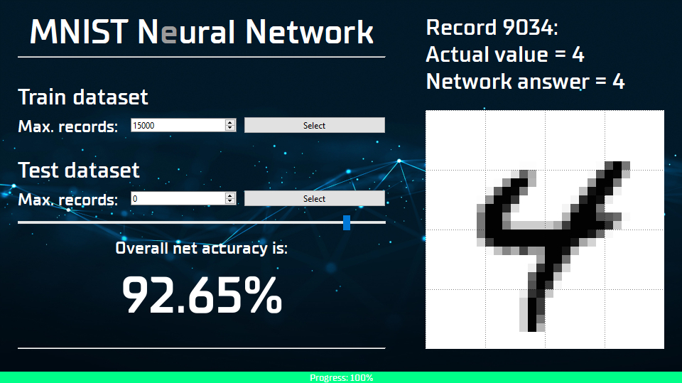

# <p align="center">MNIST Neural Network Demo with GUI</p>



> A simple Python demo project with a GUI for handwritten digit recognition ([MNIST](https://www.kaggle.com/datasets/hojjatk/mnist-dataset) dataset), with training and visualization of results

---

## 🧩 Features

- Visual interface on PyQt6
- Training the neural network on the MNIST training dataset
- Testing and displaying recognition accuracy
- Viewing individual images and predictions
- Separate threads for analysis and training (`ThreadPoolExecutor`)

---

## ⚡️ Quick start

```bash
# 1. Clone the project
git clone https://github.com/lovk4ch/simpleNeuralNetwork.git
cd simpleNeuralNetwork

# 2. Install dependencies
pip install -r requirements.txt

# 3. Run the app
python -m src.main
